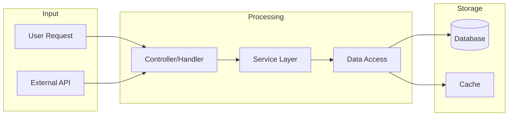

# {{PROJECT_NAME}} - Exploration Report

## Executive Summary

<!--
1-2 段落概述:
- 项目用途 (解决什么问题)
- 技术栈 (语言、框架、数据库)
- 架构风格 (单体/微服务、MVC/Clean Architecture 等)
- 项目成熟度 (POC/生产级、活跃开发/维护模式)
-->

## Quick Facts

| Attribute | Value |
|-----------|-------|
| Language | |
| Framework | |
| Database | |
| Lines of Code | |
| Test Coverage | |
| Last Updated | |
| License | |

## Directory Structure

```
{{PROJECT_NAME}}/
├── src/                    # [描述]
│   ├── core/               # [描述]
│   ├── api/                # [描述]
│   └── utils/              # [描述]
├── tests/                  # [描述]
├── config/                 # [描述]
├── docs/                   # [描述]
└── [其他关键目录]
```

<!--
注释说明:
- 每个目录的职责
- 关键文件的用途
- 命名约定
-->

## Core Components

### Component 1: [Name]
- **Location**: `path/to/component`
- **Responsibility**:
- **Key Files**:
  - `file1.py` -
  - `file2.py` -
- **Dependencies**:
- **Notes**:

### Component 2: [Name]
<!-- 同上结构 -->

## Data Flow Diagram



<!--
替换为实际数据流:
- 用户请求如何处理
- 数据如何读写
- 外部服务如何集成
-->

## Key Design Patterns

### Pattern 1: [Name]
- **Where**:
- **Why**:
- **Example**:

### Pattern 2: [Name]
<!-- 同上 -->

### Conventions
- **Naming**:
- **File Organization**:
- **Error Handling**:
- **Logging**:
- **Configuration**:

## Critical Files

<!-- 必须了解的关键文件，按重要性排序 -->

| File | Purpose | Priority |
|------|---------|----------|
| `path/to/file1` | | Must Read |
| `path/to/file2` | | Must Read |
| `path/to/file3` | | Important |
| `path/to/file4` | | Reference |

## API Reference

<!-- 如果有 API，列出关键端点 -->

| Method | Endpoint | Description |
|--------|----------|-------------|
| GET | `/api/v1/resource` | |
| POST | `/api/v1/resource` | |

## Data Model

<!-- 如果有数据库，列出关键表/集合 -->

### Table: [name]
| Column | Type | Description |
|--------|------|-------------|
| id | INTEGER | Primary key |
| | | |

## Dependencies

### Key Dependencies
| Package | Version | Purpose |
|---------|---------|---------|
| | | |

### Notable Points
-
-

## Environment Setup

### Prerequisites
-

### Installation
```bash
#
```

### Configuration
```bash
# Required environment variables
export VAR_NAME=value
```

### Running
```bash
# Development
# Production
```

---

## Clarification Questions

<!--
这部分非常重要！
识别需要进一步了解的问题，帮助开发者深入理解项目。
-->

### Architecture
- [ ]
- [ ]

### Data Model
- [ ]
- [ ]

### Business Logic
- [ ]
- [ ]

### Operations
- [ ]
- [ ]

### Security
- [ ]
- [ ]

---

## Task-Specific Analysis

<!--
如果用户提供了任务描述，这部分针对任务分析:
- 任务涉及哪些模块
- 需要修改哪些文件
- 潜在风险和注意事项
- 建议的实现路径
-->

### Task: {{TASK_DESCRIPTION}}

#### Relevant Components
-

#### Files to Modify
-

#### Potential Challenges
-

#### Suggested Approach
1.
2.
3.

---

## Next Steps

<!-- 探索完成后的建议行动 -->

### Immediate
- [ ] 回答上述澄清问题
- [ ]

### Before Development
- [ ]
- [ ]

### Recommended Reading Order
1.
2.
3.

---

## Appendix

### Git History Highlights
<!-- Deep 级别时包含 -->
-
-

### Performance Notes
<!-- Deep 级别时包含 -->
-
-

### Security Considerations
<!-- Deep 级别时包含 -->
-
-
