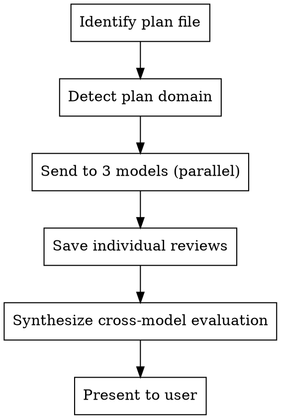

# Plan Review — Multi-AI Expert Analysis

## Overview

Send an implementation plan to 3 AI models (Gemini, Grok, ChatGPT) with differentiated review prompts, then synthesize their feedback into actionable changes. Each model plays a distinct role to maximize coverage.

## Workflow



## Usage

```
/plan-review <plan-file-path>
/plan-review                     # prompts for file path
```

## Execution Steps

### Step 1: Identify the Plan File

If the user provides a path, use it. Otherwise, search recent plan files:
```
Glob: Documents/Obsidian Vault/研究/研究笔记/plan-*.md
```
If multiple plans found, ask user which one.

### Step 2: Detect Plan Domain and Customize Prompts

Read the plan file. Determine the domain (investment infra, data pipeline, frontend, etc.) and customize the 3 reviewer prompts accordingly.

### Step 3: Run the Review Script

Execute the multi-AI review via the Python script:

```bash
/c/Users/thisi/AppData/Local/Python/pythoncore-3.14-64/python.exe \
  C:\Users\thisi\.claude\skills\plan-review\scripts\review.py \
  "<plan-file-path>" \
  --output-dir "<same directory as plan file>"
```

The script:
- Reads the plan file
- Sends to Gemini (`gemini-3-pro-preview`), Grok (`grok-4-1-fast-reasoning`), ChatGPT (`o3`) in parallel threads
- Each model gets a role-specific prompt (see Role Assignments below)
- Saves 3 individual review files: `{plan-name}-review-{model}.md`
- Returns paths of saved files

### Step 4: Synthesize Cross-Model Evaluation

After the script completes, read all 3 review files and produce a synthesis:

**Agreement Matrix** — Issues flagged by 2+ models → "Must-fix"
**Disagreement Analysis** — Where models differ → evaluate which is right
**Quality Ranking** — Grade each model's review (A/B/C) with strength/weakness
**Top N Changes** — Synthesized priority list of concrete, actionable changes

Save synthesis to: `{plan-name}-review-synthesis.md`

Present the synthesis to the user in a concise table format.

## Role Assignments

| Model | Role | Focus |
|-------|------|-------|
| **Gemini** | Senior Architect | Architecture, schema design, data model, migration strategy, implementation order |
| **Grok** | Contrarian / Risk Finder | Kill shots, operational risks, edge cases, over/under-engineering, production failures |
| **ChatGPT** | Domain Expert | Signal quality, best practices, cost-benefit, backtesting gaps, investment utility |

### Prompt Templates

Each model receives the full plan content plus a role-specific review prompt. The prompts request 7-8 numbered sections ending with "Top 5 Changes."

**Gemini sections:** Architecture Assessment, Data Model Review, API Integration Risks, What's Missing, Implementation Order Critique, Alternative Approaches, Concrete Improvements

**Grok sections:** Kill Shots, Data Quality Traps, Operational Risks, Over-Engineering Check, Under-Engineering Check, Missing Edge Cases, Alternative Approaches, Top 5 Changes

**ChatGPT sections:** Domain-specific quality assessment, Architecture Fitness, Coverage Analysis, Schema/Design Review, Gap Analysis, Integration Complexity, Cost-Benefit, Top 5 Improvements

Adjust section names to match the plan's domain (e.g., "Investment Signal Quality" for finance plans, "API Design Review" for backend plans).

## Output Files

All saved to the same directory as the plan file:

| File | Content |
|------|---------|
| `{plan-name}-review-gemini.md` | Gemini's full review |
| `{plan-name}-review-grok.md` | Grok's full review |
| `{plan-name}-review-chatgpt.md` | ChatGPT's full review |
| `{plan-name}-review-synthesis.md` | Cross-model synthesis with prioritized changes |

Each file gets YAML frontmatter: `tags: [plan-review, {domain}], date: {today}, model: {model}`

## Configuration

API keys loaded from `~/Screenshots/.env` and `~/13F-CLAUDE/.env`:
- `GEMINI_API_KEY` — Google AI
- `XAI_API_KEY` — Grok (xAI)
- `OPENAI_API_KEY` — ChatGPT

## Common Mistakes

- **Sending raw plan without context** — Always include the plan's purpose and who the user is
- **Same prompt for all models** — Each model should have a differentiated role
- **Skipping synthesis** — Individual reviews are less useful than the cross-model comparison
- **Not grading reviewers** — Some models give better advice on certain topics; note quality differences
